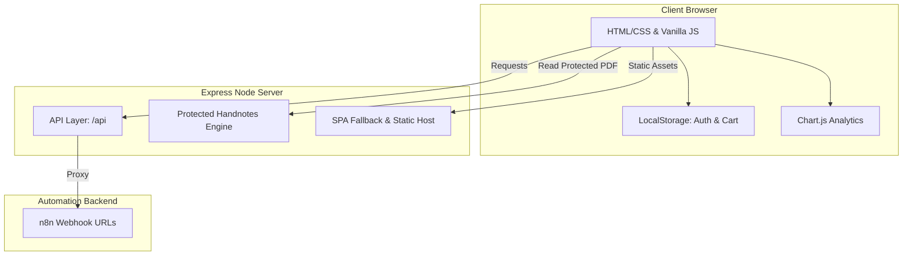

# Code With Pritom — LMS Project Analysis

This document outlines a comprehensive analysis of the "Code With Pritom" Learning Management System (LMS). It explains the architecture, module flow, dependencies, frontend/backend mechanisms, and provides code quality & bug observations.

---

## 🏗️ High-Level System Architecture

The project functions as a hybrid static frontend / dynamic backend, leveraging an Express.js server that acts as a security layer and JSON proxy to external automated backends powered by **n8n**.



---

## ⚙️ Tech Stack Details

- **Backend**: Node.js, Express.js
- **Frontend**: Semantic HTML5, Tailwind CSS (CDN-hosted), Vanilla CSS (`css/style.css`), Chart.js
- **State Management**: Client-side `localStorage` (`user`, `cwp_cart`, `cwp-progress-<courseId>`)
- **Automations Proxy**: `n8n` webhook integration (used for Registration, Authentication, Cart Checkouts, and Certificate Requests).
- **APIs**: `axios` driven communication layer inside Node/Express.

---

## 🗂️ Project Workspace Map

```text
📦 code-with-pritom-lms
 ┣ 📂 public                      # Frontend Root
 ┃ ┣ 📂 css
 ┃ ┃ ┗ 📜 style.css               # Core application style guidelines
 ┃ ┣ 📂 data
 ┃ ┃ ┗ 📜 workshop.json           # Metadata storage for live/archived sessions
 ┃ ┣ 📂 js
 ┃ ┃ ┣ 📜 auth.js                 # Auth validations, logins, registration & daily syncer
 ┃ ┃ ┣ 📜 cart.js                 # Add-to-cart state, Promo Code application, bKash Checkout
 ┃ ┃ ┣ 📜 main.js                 # Landing Page handler, Roadmaps & Analytics widgets
 ┃ ┃ ┗ 📜 ui.js                   # Global UI class (Toasts, Sidebars, Tabs) & Workshop Proxy
 ┃ ┣ 📜 cart.html                 # Checkout and order success step-indicator page
 ┃ ┣ 📜 classroom.html            # Youtube embed player with notes, checklists & lock-screens
 ┃ ┣ 📜 dashboard.html            # Primary dashboard for enrolled & explored courses
 ┃ ┣ 📜 index.html                # Marketing / Public landing page
 ┃ ┗ 📜 workshop.html             # Exclusive Live Workshop & Archive Stream player
 ┣ 📂 node_modules
 ┣ 📜 .env                        # External credentials (N8N_WEBHOOK_URL, etc.)
 ┣ 📜 package.json                # Manifest & script declarations (dev, start)
 ┣ 📜 server.js                   # Express.js service entrypoint
 ┗ 📜 LMS Master Controller.json  # Configuration/Backup templates
```

---

## 🔄 Logic Flows

### 🔑 1. Authentication & Hydration Flow
1. A user attempts login on `index.html`.
2. `public/js/auth.js` intercepts input and executes `POST /api/auth` with `{ action: 'login' }`.
3. `server.js` forwards payloads directly to `process.env.N8N_AUTH_WEBHOOK_URL`.
4. Upon successful JSON response:
   - User Object `data.user` (containing access list e.g., `1, 2, 4`) is stored in `localStorage` using the key `'user'`.
   - Browser re-routes to `dashboard.html`.
5. On subsequent days, `Auth.syncSessionSilently()` triggers to update permission vectors (e.g., a payment cleared in n8n while offline).

### 🛒 2. Cart & Checkout Flow
1. A user clicks "Buy Course" inside Dashboard or Classroom.
2. `Cart.add(...)` appends course payload to `localStorage.getItem('cwp_cart')`.
3. Inside `cart.html` (Multi-step Workflow):
   - **Step 1 (Summary)**: Display items & subtotal.
   - **Step 2 (Billing)**: Form asking for Name, Email, Phone & City.
   - **Step 3 (Payment)**: Discount code verification via `GET /api/promo-codes` and bKash Instruction Box (requiring manually inputting TxnID).
   - **Step 4 (Submit)**: Executing `POST /api/checkout` passing complete metadata to n8n.

### 🎓 3. Learning Module (Classroom)
1. Reading `courseId` parameter from URL (`?id=X`).
2. Evaluates `accessList` from LocalStorage.
   - **Denied**: Render `lock-screen` (Access Denied overlay with "Enroll" CTAs).
   - **Granted**: Hydrate lesson lists and launch first video using YouTube Iframe embeds.
3. Personal user variables (Checkbox progressions, Custom Notepad scratchpads) are saved directly back to localized storage.

---

## 💡 Code Observations & Recommended Fixes

During file traversal, the following key architectural items and potential bug locations were identified:

### ⚠️ 1. LocalStorage Key Inconsistency
In `public/js/auth.js`, authentication methods persistently query and save objects to the `'user'` key.
```javascript
// File: public/js/auth.js
static getUser() {
    return JSON.parse(localStorage.getItem('user'));
}
```
However, inside `dashboard.html` (Line 673), the sync method updates a *different* key name:
```javascript
// File: public/dashboard.html
window.refreshUserAccess = (newAccess) => {
    const user = Auth.getUser();
    if (user && newAccess) {
        user.access = newAccess;
        localStorage.setItem('cwp-user', JSON.stringify(user)); // <-- Mismatch!
        ...
    }
};
```
> **Impact:** When accessing `cwp-user`, `Auth.getUser()` will not pick up modifications on next reload, as it only reads from `'user'`.
> **Action Item**: Change `localStorage.setItem('cwp-user', ...)` to `localStorage.setItem('user', ...)` or ideally invoke `Auth.setUser(user)`.

### 🔒 2. PDF Security Implementation
The backend server implements excellent anti-scrape safeguards inside `server.js` for `api.get('/handnotes/:filename')`:
- Prevents path traversals (`..`, `/`, `\`).
- Sets strong Headers: `inline` Content-Disposition, strict cache-busting, `no-store`, and `X-Robots-Tag: noindex`.
However, note that currently, the classroom `classroom.html` links to external resources directly (Blogger/Medium) for most notes, limiting full exploitation of this microservice unless users explicitly upload PDFs into a `handnotes` directory.

### 📈 3. Dynamic Live Webhooks
The frontend explicitly queries distinct production tunnels for auxiliary widgets:
- **Workshop Registry**: `https://arup-vivobook-asuslaptop-x509dj-d509dj.taila8249c.ts.net/webhook/join-workshop`
- **Live Stats Graphic**: `https://arup-vivobook-asuslaptop-x509dj-d509dj.taila8249c.ts.net/webhook/get-live-stats`
These use static strings rather than environment fallbacks. In local dev modes, failure in these sub-hooks is caught gracefully via try-catches, leaving static loading states or empty blocks.

---

## 📋 Roadmap Execution Log

Comparing user directives found in `Add my provided brand image in fron.txt` against currently live modules:

- [x] **Course Additions**: (Linux, n8n, C, Math, Java, OOP, Scripting) - Fully incorporated into index modals (`main.js`) and user dashboard arrays (`dashboard.html`).
- [x] **Interactive Roadmaps**: Timelines are rendered dynamically within overlay frames (`openCourseModal` inside `public/js/main.js`).
- [x] **Visual Upgrades**: Handnotes platform integration with Blogger/Medium visual tokens and Chart.js integrations implemented.
- [x] **Brand Visuals**: Embedded inside `index.html` using `images/brand.png`.
- [x] **Reviews & Testimonials Section**: Populated with six cards highlighting digital marketers, devs, and students.
- [x] **FAQ Subsections**: Fully detailed collapsible panel set deployed.
